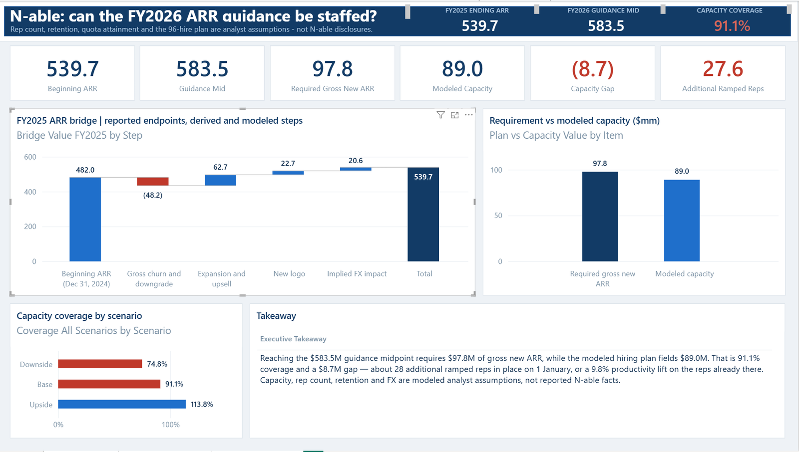
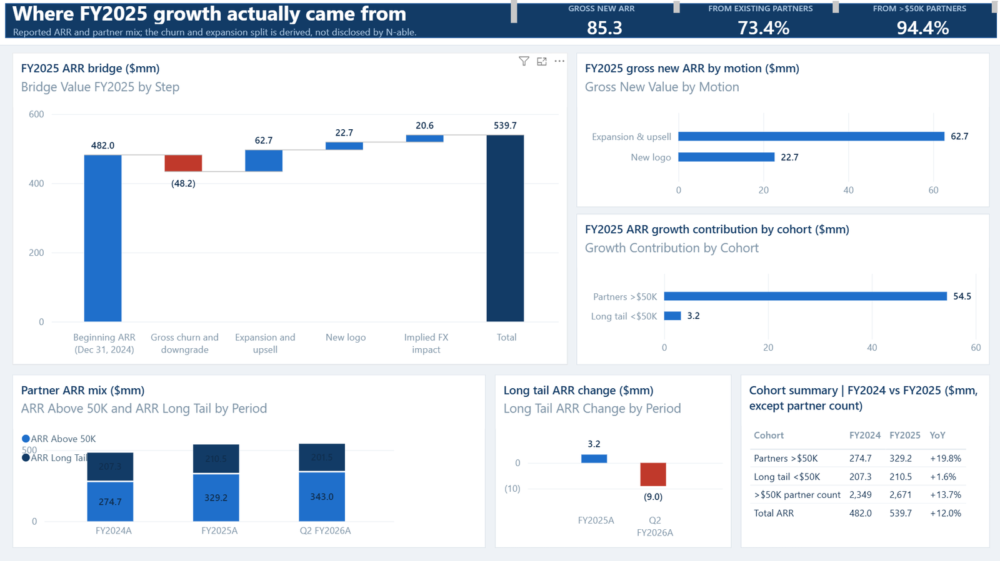
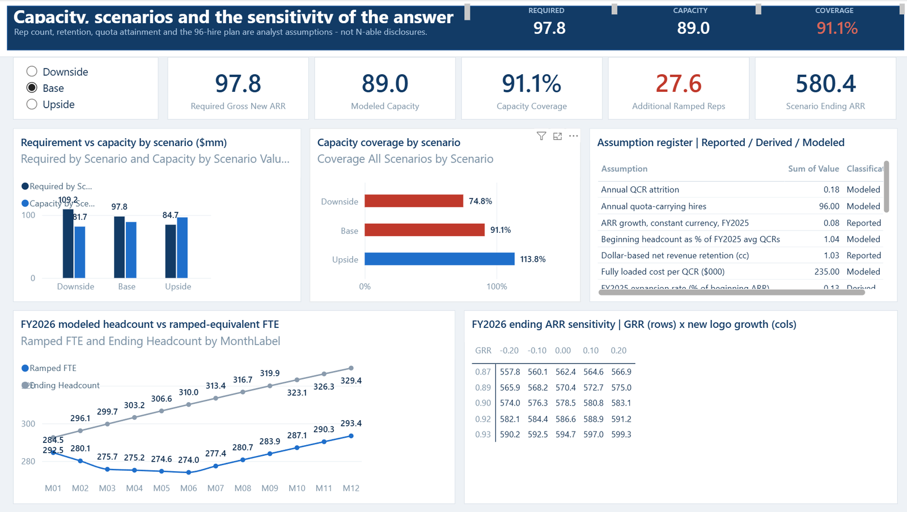
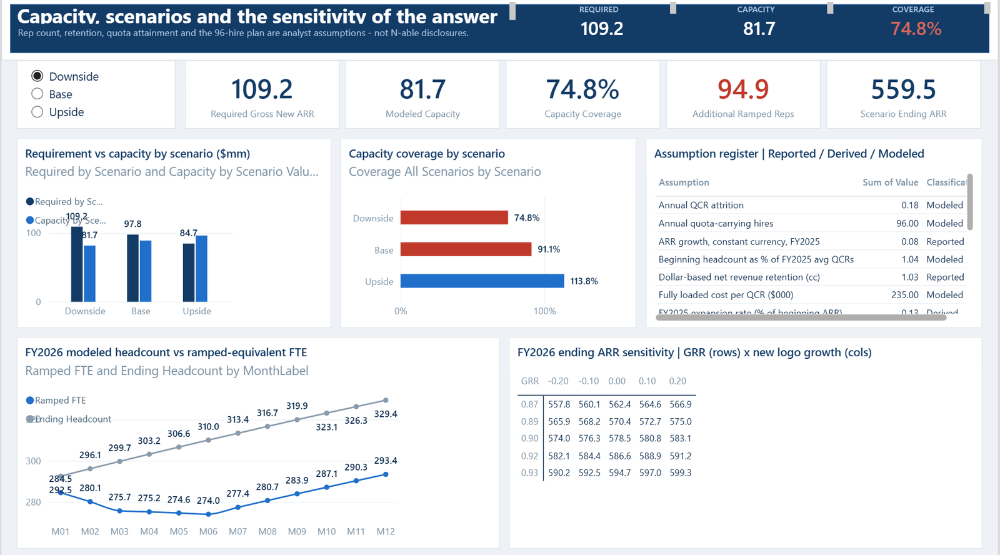
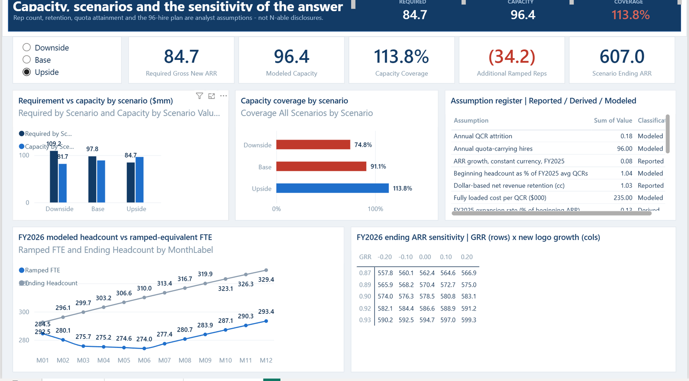

# Can N-able staff its own FY2026 ARR guidance?

A three-page Power BI dashboard that tests one question: when N-able (NASDAQ: **NABL**)
guided to **$581–586M** of FY2026 ARR, did it have the sales capacity to deliver it?

**Modeled answer: no, not on the staffing case examined here.** Reaching the $583.5M
midpoint requires **$97.8M** of gross new ARR. A modeled 96-hire plan fields **$89.0M** —
**91.1% coverage**, an **$8.7M** gap, roughly **28 additional ramped reps** needed in place
on 1 January. The base case lands at **$580.4M**, about **$0.6M below the guidance floor**.

On 6 Aug 2026 N-able cut FY2026 ARR guidance to **$562–565M**.

All three pages are below. The `.pbix` in this repo opens directly in Power BI Desktop —
the model is imported, so nothing needs to refresh.

> The capacity conclusion is a **modeled** result built on analyst assumptions, not a
> forecast and not something N-able published. See [Reported / Derived / Modeled](#reported--derived--modeled)
> before quoting any number here.

---

## Pages

### 1 · Executive Summary
The FY2025 ARR bridge, the requirement-versus-capacity comparison, coverage across three
scenarios, and a takeaway that rewrites itself from the live measures.



### 2 · ARR Growth & Partner Mix
Where FY2025 growth actually came from: expansion versus new logo, and the concentration
of growth in partners above $50K.



### 3 · GTM Capacity & Scenarios
The scenario switch, the monthly ramp schedule behind the capacity number, the assumption
register, and a 5×5 sensitivity grid on ending ARR.



The slicer is a disconnected table read by `SELECTEDVALUE`, which is what replaces the
Excel scenario switch at `Assumptions!B6` — that cell stops being interactive once the
workbook is imported. Same page, downside and upside selected:

| Downside — 74.8% coverage | Upside — 113.8% coverage |
|---|---|
|  |  |

---

## The capacity calculation

The chain from a reported expense line to a modeled capacity number:

| Step | Value | Class |
|---|---|---|
| FY2025 S&M expense | $163.163M | Reported |
| × quota-carrying comp as % of S&M | 40% | **Modeled** |
| = quota-carrying cost pool | $65.265M | Modeled |
| ÷ fully loaded cost per rep | $235K | **Modeled** |
| = implied average quota carriers, FY2025 | 277.7 | Modeled |
| FY2025 gross new ARR delivered | $85.314M | Derived |
| ÷ average quota carriers | $0.307M per rep | Modeled |
| ÷ quota attainment | 85% | **Modeled** |
| = implied quota per fully ramped rep | $0.361M | Modeled |
| × FY2026 quota inflation | 3% | **Modeled** |
| = FY2026 quota per ramped rep | $0.372M | Modeled |

That rate is then applied to a monthly headcount schedule — 288.8 reps on 1 Jan 2026,
96 hires spread evenly, 18% annual attrition, and a ramp of 0% in months 1–3, 50% in
months 4–6, 100% from month 7. The schedule averages **281.4 ramped-equivalent rep-years**.

```
281.4 ramped FTE  ×  $0.372M quota  ×  85% attainment  =  $89.0M capacity
```

On the requirement side:

```
required gross new ARR = (guidance mid − FX) − beginning ARR + beginning ARR × (1 − GRR)
                       = (583.5 − 0) − 539.7 + 539.7 × (1 − 0.90)
                       = $97.8M
```

**$89.0M against $97.8M is 91.1%.**

---

## Scenarios

The hiring plan and ramp schedule are identical in all three scenarios. Only quota
attainment moves capacity; GRR, new-logo growth and FX move the requirement.

| | Downside | Base | Upside |
|---|---:|---:|---:|
| Gross revenue retention | 88.8% | 90.0% | 91.5% |
| New logo growth vs FY2025 | −5% | +8% | +20% |
| Quota attainment | 78% | 85% | 92% |
| FX impact on ending ARR | −$5.0M | $0.0M | +$5.0M |
| **Required gross new ARR** | **$109.2M** | **$97.8M** | **$84.7M** |
| **Modeled capacity** | **$81.7M** | **$89.0M** | **$96.4M** |
| **Coverage** | **74.8%** | **91.1%** | **113.8%** |
| FY2026 ending ARR | $559.5M | $580.4M | $607.0M |
| vs original guidance floor ($581M) | −$21.5M | −$0.6M | +$26.0M |

Only the upside case clears the original guidance. The base case misses it by less than a
million — which is the point of the exercise: the guidance was not obviously wrong, it was
*thin*, and it depended on quota attainment landing at or above plan.

---

## What FY2025 growth was made of

| | FY2024 | FY2025 | YoY |
|---|---:|---:|---:|
| Partners >$50K | $274.7M | $329.2M | +19.8% |
| Long tail <$50K | $207.3M | $210.5M | +1.6% |
| >$50K partner count | 2,349 | 2,671 | +13.7% |
| **Total ARR** | **$482.0M** | **$539.7M** | **+12.0%** |

**94.4%** of the $57.7M FY2025 ARR increase came from partners above $50K. The long tail
added $3.2M in FY2025 and then *shrank* $9.0M by Q2 FY2026.

Of the $85.3M gross new ARR in FY2025, **73.4%** was expansion and upsell into the
installed base and 26.6% was new logo. The growth engine is the existing base, not
acquisition — which is what makes rep capacity the binding constraint rather than
demand generation.

---

## Reported / Derived / Modeled

Every figure in the dashboard carries one of three labels, and the assumption register on
page 3 shows the classification next to each input. This is not decoration — the
difference between "N-able reported this" and "I assumed this" is the difference between
analysis and fabrication.

**Reported** — disclosed by N-able in an SEC filing, press release or earnings call:
ARR, guidance, NRR, partner counts, cohort ARR share, S&M expense.

**Derived** — arithmetic on reported figures only, no judgement added:
expansion ARR, new logo ARR, implied FX, cohort ARR, growth shares.

**Modeled** — analyst assumptions. **Never presented as N-able facts:**
rep headcount, gross revenue retention, fully loaded cost per rep, the S&M allocation,
expansion rate, quota attainment, the 96-hire plan, and FX.

N-able has never disclosed a hiring plan. **The 96-hire plan is a staffing case
constructed for this analysis.** It is not a leak, a forecast, or a company statement.

---

## Repository

| File | What it is |
|---|---|
| `Nable_GTM_Capacity_Dashboard.pbix` | the report — 3 pages, 22 tables, 59 measures |
| `Nable_SaaS_GTM_Capacity_Model_v2.xlsx` | the 8-tab source model |
| `Nable_PowerBI_Input.xlsx` | 12 flattened sheets the report loads |
| `measures.dax` | all 59 measures in one `DEFINE` block |
| `calculated_tables.dax` | the 11 calculated tables |
| `Nable_Theme.json` | report theme |
| `images/` | page exports |

### Opening it

Open `Nable_GTM_Capacity_Dashboard.pbix` in **Power BI Desktop** (Windows).
No data source refresh is needed — the model is imported and self-contained.

### Rebuilding from scratch

1. `Get Data > Excel workbook` → `Nable_PowerBI_Input.xlsx` → load all 12 sheets
2. Rename `Scenario_Table` → `Scenario`, `GTM_Capacity_Monthly` → `Capacity Monthly`,
   `Assumptions_Register` → `Assumptions`
3. Run `calculated_tables.dax` block by block via `Modeling > New table`
4. Paste `measures.dax` into DAX query view → **Update model: add new measures**
5. Delete every auto-detected relationship — the model is intentionally relationship-free
6. Apply `Nable_Theme.json`

Two things that will bite you if you skip them: the measure-holder table must be called
`_Measures` (Power BI reserves `Measures`), and `Partner Mix[Period]` must sort by itself
rather than by `[Order]`, or every period splits into two categories on the axis.

---

## Validation

The model reconciles to the source workbook on the base case:

| Measure | Dashboard | Source cell |
|---|---:|---|
| Beginning ARR | 539.7 | `Actuals!E7` |
| Guidance mid | 583.5 | `Actuals!E28` |
| Required gross new ARR | 97.77 | `'ARR Bridge'!C39` |
| Modeled capacity | 89.039 | `'GTM Capacity'!B50` |
| Capacity coverage | 91.07% | `'GTM Capacity'!B53` |
| Additional ramped reps | 27.594 | `'GTM Capacity'!B57` |
| Scenario ending ARR | 580.357 | `Scenarios!C19` |

---

## Sources

| | |
|---|---|
| [1] | Q4/FY2025 8-K Ex-99.1, 18 Feb 2026 |
| [2] | Q4 FY2025 earnings call, 19 Feb 2026 |
| [3] | Q4 FY2024 earnings call, Feb 2025 |
| [4] | Q1 FY2026 results, 6 May 2026 |
| [5] | Q2 FY2026 call, 17 Aug 2026 |
| [6] | Q3 FY2025 results, Nov 2025 |

---

## Use

Independent analysis for portfolio purposes. Not affiliated with, endorsed by, or reviewed
by N-able, Inc. Not investment advice and not a recommendation to buy or sell any security.
Reported figures belong to N-able; the model, the assumptions and the conclusions are mine.
